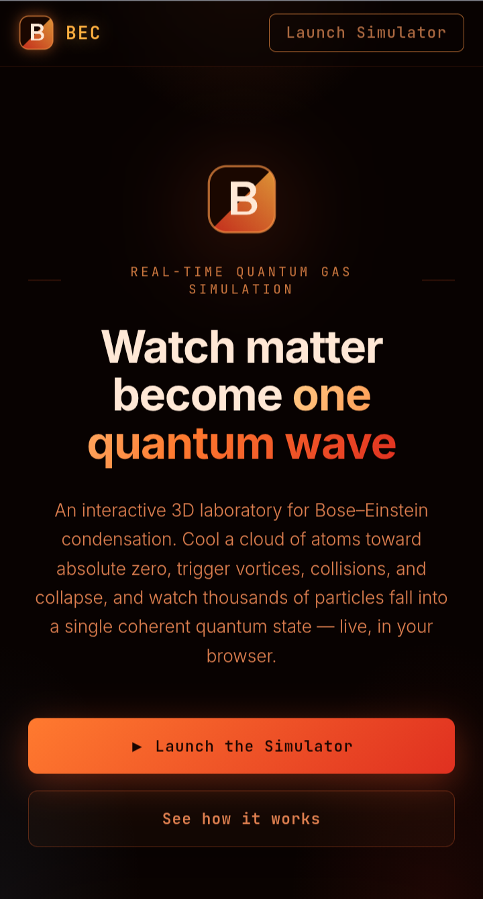

# BEC — Bose–Einstein Condensate Simulator

A real-time, interactive 3D laboratory for Bose–Einstein condensation, running entirely in the browser. Cool a cloud of atoms toward absolute zero, trigger vortices, collisions, and time-of-flight expansion, and watch thousands of particles collapse into a single coherent quantum state.

 

**🔗 Live Demo:** [nazat02.github.io/Bose-Einstein-Condensed](https://nazat02.github.io/Bose-Einstein-Condensate/)



---

## ✨ Features

- **Real-time 3D particle simulation** of a trapped ultracold atomic gas
- **Temperature control** — cool the cloud below the critical temperature (Tc) and watch the condensate fraction (N₀/N) grow
- **Vortex & laser-stir modes** to induce quantized vortices in the condensate
- **Collision mode** to merge/interact two clouds
- **Time-of-flight (TOF) expansion** — release the trap and observe the momentum distribution (condensate peak + thermal halo)
- **Surface density graph** — smooth, high-resolution view of the cloud's density profile
- **Snapshot tool** — capture the current view as an image
- **Live readouts**: temperature, Tc, condensate fraction, particle count, and simulation log

---

## 🚀 Getting Started

No build step, no dependencies to install — it's plain HTML/CSS/JS with Three.js loaded via CDN.

```bash
git clone https://github.com/nazat02/Bose-Einstein-Condensate.git
cd Bose-Einstein-Condensate
```

Then simply open the files in a browser:

- `index.html` — landing page
- `simulation.html` — the interactive simulator

Or serve locally for the best experience:

```bash
python3 -m http.server 8000
```

Then visit `http://localhost:8000`.

---

## 🖥️ Usage

| Control | What it does |
|---|---|
| **Cool to BEC** | Lowers the temperature toward absolute zero |
| **Vortex** | Spins up a quantized vortex in the condensate |
| **Laser Stir** | Stirs the cloud with a simulated laser beam |
| **Collide** | Triggers a collision between two atom clouds |
| **TOF** | Switches off the trap for free expansion, then re-engages it (most meaningful once a BEC has formed) |
| **Surface** | Toggles to a smooth 3D surface plot of the density distribution |
| **Snapshot** | Saves the current render as an image |

---

## 🧪 The Physics (in brief)

As the temperature `T` drops below the critical temperature `Tc`, a macroscopic fraction of atoms condense into the ground state, following:

```
N₀/N ≈ 1 − (T / Tc)³
```

The simulation visualizes this transition: a diffuse thermal cloud collapses into a dense, sharply-peaked condensate at the trap center. During TOF, this is revealed as a sharp peak (condensate, near-zero momentum) sitting on top of a broad thermal background.

---

## 🛠️ Tech Stack

- **Three.js** — WebGL-based 3D rendering of particles and surfaces
- **Vanilla JS / HTML / CSS** — no framework, no build tools
- **JetBrains Mono / Inter** — UI typography

---

## 📂 Project Structure

```
.
├── index.html        # Landing page
├── simulation.html    # Interactive BEC simulator
└── LICENSE
```

---

## 🤝 Contributing

Issues and pull requests are welcome! If you'd like to add new modes, improve the physics model, or polish the UI, feel free to open a PR.

---

## 📄 License

This project is licensed under the [MIT License](LICENSE).
